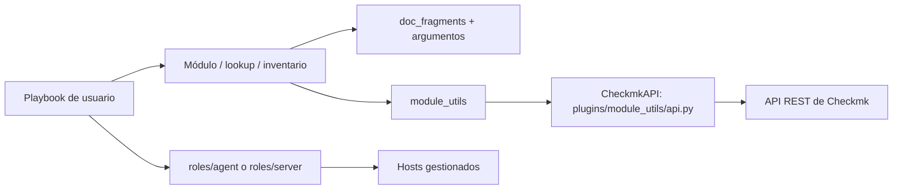

# Contexto del espacio de trabajo

## Alcance y ubicación

Este espacio de trabajo contiene el clon de `ansible-collection-checkmk.general/`.
La colección es el proyecto que se debe modificar cuando una tarea lo autorice
explícitamente. Este fichero, junto con `AGENTS.md` y `CLAUDE.md`, vive fuera de
la colección para conservar contexto entre sesiones sin alterar el clon.

## Propósito

`checkmk.general` es la colección oficial de Ansible para Checkmk. Aporta:

- módulos que administran recursos de un sitio Checkmk mediante su API REST;
- plugins de lookup e inventario dinámico;
- roles para instalar/configurar el servidor Checkmk y sus agentes;
- playbooks de ejemplo y pruebas automatizadas.

No es una aplicación web ni un servicio ejecutable único: Ansible descubre y
ejecuta sus módulos, plugins y roles como contenido de colección.

## Stack y compatibilidad

| Área | Tecnología / versión |
| --- | --- |
| Lenguajes | Python y YAML/Ansible |
| Empaquetado de desarrollo | `uv` y `pyproject.toml` |
| Python mínimo declarado | 3.11 |
| Colección | `checkmk.general` 8.1.0 |
| Ansible mínimo declarado | 2.18 (`meta/runtime.yml`) |
| CI de Ansible | 2.16 a 2.21 y `devel` |
| Python en CI | 3.13 |
| Calidad Python | Black 26.5.1, isort 8.0.1 |
| Calidad Ansible/YAML | ansible-lint 26.6.0, yamllint 1.38.0 |
| Pruebas de roles | Molecule 26.6.0 + plugin Podman 26.7.8 |

No hay `uv.lock`; `uv sync` resuelve las versiones fijadas en `pyproject.toml`.
Las dependencias de colección declaradas en `galaxy.yml` incluyen
`community.general`, `ansible.posix` y `ansible.windows`.

## Estructura

```text
ansible-collection-checkmk.general/
├── plugins/
│   ├── modules/         Módulos Ansible para objetos de Checkmk
│   ├── lookup/          Consultas de datos de Checkmk
│   ├── inventory/       Plugin de inventario dinámico
│   ├── module_utils/    API REST, versiones, diferencias y utilidades comunes
│   └── doc_fragments/   Fragmentos reutilizables de documentación inline
├── roles/
│   ├── agent/           Instalación/configuración del agente Checkmk
│   └── server/          Instalación/configuración de un sitio Checkmk
├── playbooks/           Demos, inventarios y casos de uso
├── tests/
│   ├── unit/            Pruebas Python, reflejan `plugins/`
│   └── integration/     Objetivos de `ansible-test` por módulo/lookup
├── docs/                Documentación RST generada; no editar manualmente
├── changelogs/
│   ├── fragments/       Fragmentos de changelog requeridos por cambio
│   └── archive/         Fragmentos ya publicados
├── .github/workflows/   CI por módulo/lookup, QA, lint, Molecule y release
├── misc/                Ficheros auxiliares y especificaciones OpenAPI
├── scripts/             Utilidades de pruebas y releases
├── galaxy.yml           Metadatos, versión y dependencias de la colección
├── meta/runtime.yml     Compatibilidad de Ansible y grupo de acciones
├── pyproject.toml       Dependencias y configuración de formato Python
├── Makefile             Atajos históricos basados en Vagrant
└── Vagrantfile          Entorno de desarrollo/pruebas con máquinas virtuales
```

## Flujo y puntos de entrada



Los módulos definen `DOCUMENTATION`, `EXAMPLES` y `RETURN` en el propio Python.
Normalmente crean una clase de recurso y reutilizan `CheckmkAPI` en
`plugins/module_utils/api.py`, que compone la URL REST
`<server_url>/<site>/check_mk/api/1.0`. `differ.py`, `utils.py`, `types.py` y
los módulos `discovery_<versión>.py` encapsulan lógica compartida y diferencias
entre versiones de Checkmk.

Referencias iniciales útiles:

- `plugins/module_utils/api.py`: cliente REST, autenticación y manejo HTTP.
- `plugins/modules/host.py`: módulo representativo de gestión de recursos.
- `plugins/inventory/checkmk.py`: inventario dinámico.
- `roles/{agent,server}/tasks/main.yml`: entradas de los roles.
- `galaxy.yml` y `meta/runtime.yml`: contrato de la colección.
- `README.md`, `USAGE.md`, `INSTALL.md` y `CONTRIBUTING.md`: documentación de usuario y contribución.

## Desarrollo y ejecución local

Desde `ansible-collection-checkmk.general/`:

```bash
uv venv
uv sync

# Construir e instalar el artefacto local
uv run ansible-galaxy collection build --force ./
uv run ansible-galaxy collection install -f ./checkmk-general-8.1.0.tar.gz
```

Para consumidores, la colección publicada se instala con:

```bash
ansible-galaxy collection install checkmk.general
```

El `Makefile` ofrece los atajos `make build`, `make install` y una ruta de
pruebas basada en Vagrant/KVM. Para trabajo actual, los workflows de GitHub
Actions y los comandos `uv run` son la referencia más fiable.

### Servidor Checkmk local disponible

Hay un contenedor Docker llamado `monitoring` que expone Checkmk en
`http://localhost:8080/cmk/check_mk/login.py`; el sitio es `cmk`. Puede usarse
para pruebas de integración manuales autorizadas. Las credenciales se deben
obtener del propietario del entorno o de variables/secretos locales: no se
almacenan en el repositorio ni en esta documentación.

## Verificación

Ejecutar desde la raíz de la colección. `--docker` debe quedar al final de los
comandos de `ansible-test`.

```bash
# Formato/importaciones Python
uv run black --check --diff plugins
uv run isort --check --diff plugins

# YAML y Ansible
uv run yamllint -c .yamllint ./roles/ ./playbooks/ ./tests/
uv run ansible-lint -c .ansible-lint ./roles/ ./playbooks/ ./tests/

# Pruebas Ansible
uv run ansible-test sanity --docker
uv run ansible-test units --docker
uv run ansible-test integration --docker

# Roles; elegir escenario 2.3, 2.4 o 2.5
(cd roles/server && uv run molecule test -s 2.5)
(cd roles/agent && uv run molecule test -s 2.5)
```

Las pruebas de Docker, Molecule, Vagrant o de integración pueden requerir una
imagen, permisos de contenedor o infraestructura que no estén disponibles en
todas las máquinas.

## Convenciones de código

- Python: Black e isort con perfil `black`; mantener compatibilidad con el
  estilo existente de módulos Ansible.
- YAML: `.yamllint` y `.ansible-lint`; nombres de variables según el patrón
  `checkmk_(server|agent|var)_*`; las internas comienzan por `__`.
- Variables de roles/playbooks en `snake_case`; tags con guiones.
- Módulos de una sola entidad usan opciones simples, como `name`; los que
  manejan varias entidades usan nombres cualificados, como `host_name`.
- Reutilizar `module_utils/api.py`; no duplicar la infraestructura HTTP/REST.
- La documentación de plugins vive inline. `docs/` es salida generada en el
  release y no se modifica a mano.
- Un cambio funcional debe incluir un YAML en `changelogs/fragments/`, basado
  en `changelogs/template.yml`.
- Las contribuciones se orientan a `devel`, no a `main`; los commits usan
  imperativo, presente y título de hasta 72 caracteres.

Al añadir módulo o lookup también suelen cambiarse pruebas alineadas por nombre,
README, etiquetas/workflows de CI y, para módulos, `meta/runtime.yml`.

## CI/CD y publicación

GitHub Actions ejecuta QA Python, lint, sanity, unidades, integración y
Molecule mediante workflows especializados. El workflow `release.yaml` compila
el changelog con `antsibull-changelog`, genera `docs/` con `antsibull-docs`,
construye el tarball y lo publica en Ansible Galaxy. La publicación se inicia
manualmente y requiere secretos de GitHub/Galaxy.

## Particularidades y cuestiones pendientes

- El `Makefile` presupone Vagrant, KVM y la ruta `/home/vagrant/...`; no es
  portable por defecto y parte de sus instrucciones históricas no coincide con
  la configuración actual basada en `uv`.
- `CONTRIBUTING.md` conserva ejemplos de escenarios Molecule antiguos (2.2/2.3),
  mientras que el `AGENTS.md` existente y el árbol contienen escenarios 2.3,
  2.4 y 2.5.
- Hay un TODO en `module_utils/api.py`: el reintento actual es conservador
  porque la API REST no cancela necesariamente peticiones agotadas.
- Existe un FIXME en `roles/server/meta/argument_specs.yml` y un TODO en el
  playbook demo de lookups.
- La rama clonada es `main` (último commit observado: `f77e459a`, 2026-07-14).
  La guía de contribución pide abrir PR hacia `devel`.
- Posible incidencia a confirmar: la ruta de autenticación por cookie de
  `CheckmkAPI` usa `self.cookies`, que no se inicializa en el constructor
  observado. No se ha reproducido ni corregido.
